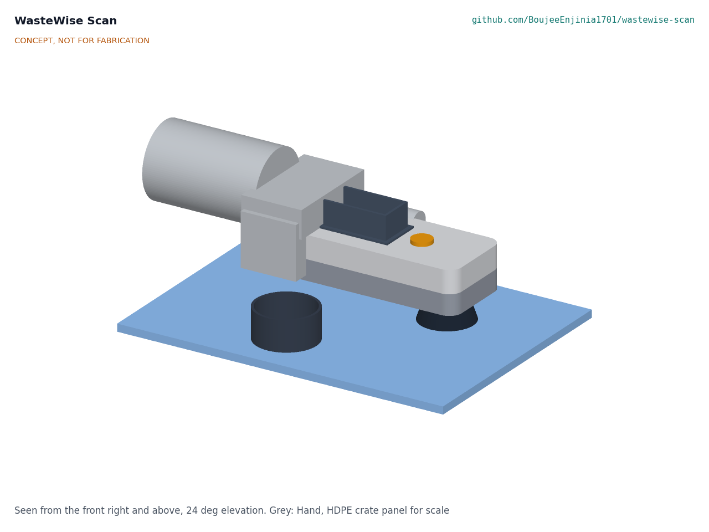

# WasteWise Scan

  

**Area:** Circular Materials · **TRL:** 3 of 9 (proof of concept on paper) · **Budget:** $150 USD volume target; prototype $164 in parts · **Difficulty:** 3 of 5

Handheld near-infrared scanner that identifies common plastic resins (PET, HDPE, PP, PS, PVC) in about a second using a low-cost multispectral sensor, shows the result and a local price grade, and logs scans. It pairs with WasteWise-ml for items the spectrum cannot resolve.

[Interactive 3D model](media/viewer.html) · [Concept blueprint (PDF)](media/concept-blueprint.pdf) · [General arrangement (PDF)](cad/drawings/WSC-DWG-001.pdf) · [Calculations](docs/04-calcs/01-sizing.md) · [Review note](docs/REVIEW.md)

## Concept rationale

Resin type is a chemical property, so the scanner measures chemistry rather than appearance. Polymers absorb short-wave infrared light at wavelengths set by their C-H bonds, and eight discrete LEDs read against one InGaAs photodiode sample those bands for a small fraction of the cost of a spectrometer. The open Plastic Scanner project from TU Delft showed that this discrete-band approach can separate common resins; WasteWise Scan adds what a waste picker or cooperative needs in the field: a result in a third of a second, a local price grade, a log, and a clear "unknown" when the scanner cannot tell.

The design is open and garage-buildable because the people who would use it most sort plastic far from any service network. Every part is an off-the-shelf module or a 3D print, the price table is edited on the device, and no cloud service is involved. An open design lets cooperatives, universities and repair shops build, fix and adapt it, and lets labeled scan data be shared with Plastic Scanner and WasteWise-ml where licenses allow.

## Burning platform

Only 9 % of plastic waste is successfully recycled worldwide ([OECD, 2022](https://www.oecd.org/en/about/news/press-releases/2022/02/plastic-pollution-is-growing-relentlessly-as-waste-management-and-recycling-fall-short.html)), and the world generated 2.56 billion tonnes of solid waste in 2022, heading for 3.86 billion tonnes by 2050 without action ([World Bank, *What a Waste 3.0*](https://www.worldbank.org/en/publication/what-a-waste)).

Much of the recycling that does happen rests on informal workers. An estimated 15 to 20 million people work as informal waste pickers ([WIEGO, citing ILO data](https://www.wiego.org/informal-economy/occupational-groups/waste-pickers)), and one widely cited model estimates that the informal sector collects about 58 % of the plastic waste collected for recycling worldwide ([Lau et al. 2020, *Science*](https://doi.org/10.1126/science.aba9475), as cited in [ISWA, 2022](https://www.iswa.org/wp-content/uploads/2022/09/A-Seat-at-the-Table.pdf)). These workers sort by eye, touch and burn tests, and a wrong call costs them money or spoils a bale.

## Where it could be used

### By industry

| Industry | Use |
| --- | --- |
| Informal waste picking and cooperatives | Settle doubtful items at the pile and grade them against the local price table |
| Aggregators and small recyclers | Spot-check incoming bales for PVC in PET and other off-resin items before paying |
| Plastic scrap trade and export | Check that a bale is clean, pre-sorted single-polymer scrap before it is declared as such |
| Municipal and extended producer responsibility programs | Audit what collection points and sorting sheds actually recover |
| Training, NGOs and research | Teach resin identification and collect open, labeled spectra for classifiers such as WasteWise-ml |

### By country or region

| Country or region | Why it matters there |
| --- | --- |
| India | A national labour survey counted about 2.2 million waste pickers, as cited by WIEGO ([WIEGO](https://www.wiego.org/informal-economy/occupational-groups/waste-pickers)) |
| Brazil | Over 281,000 people work as waste pickers (catadores), many in cooperatives that grade and sell by material ([WIEGO](https://www.wiego.org/informal-economy/occupational-groups/waste-pickers)) |
| Colombia | Bogotá alone has more than 25,000 waste pickers ([WIEGO](https://www.wiego.org/informal-economy/occupational-groups/waste-pickers)) |
| Sub-Saharan Africa (for example Kenya and Nigeria) | Collection rates are low and waste is mostly disposed of unsafely, so value recovered by informal sorters matters more ([World Bank](https://www.worldbank.org/en/publication/what-a-waste)) |
| European Union | The Packaging and Packaging Waste Regulation, in force since 11 February 2025 and applying from 12 August 2026, aims to raise the use of recycled plastics in packaging, which depends on clean resin streams ([European Commission](https://environment.ec.europa.eu/topics/waste-and-recycling/packaging-waste_en)) |
| United States | Since 1 January 2021 most plastic scrap exports need the importing country's prior written consent unless they are clean, pre-sorted, almost single-polymer scrap ([US EPA](https://www.epa.gov/hwgenerators/new-international-requirements-export-and-import-plastic-recyclables-and-waste)) |

## What sparked the idea

The idea traces back to the Basel Convention's plastic waste amendments, agreed by about 180 governments in Geneva in May 2019 ([UNEP](https://www.unep.org/news-and-stories/press-release/governments-agree-landmark-decisions-protect-people-and-planet)) and in effect from 1 January 2021. Under them, plastic scrap "almost exclusively" of one non-halogenated polymer, or a PE, PP and PET mix destined for separate recycling, that is pre-sorted and clean can move as ordinary scrap (entry B3011), while mixed, contaminated or PVC-containing plastic needs prior written consent (entry Y48) ([US EPA](https://www.epa.gov/hwgenerators/new-international-requirements-export-and-import-plastic-recyclables-and-waste)). The rule turned resin identity into a legal and commercial line, yet the check it relies on happens by eye, at the pile, long before any laboratory. A handheld that tells PET from PP or PVC at the point of sorting is the missing tool that the amendments point at.

## Problem

Cameras cannot reliably tell PET from PP or HDPE, yet resin type sets the price a waste picker or small recycler receives. Commercial near-infrared sorters cost far too much for informal and small-scale operators.

## Concept

Press the soft shroud against an item and press the button. The scanner pulses eight near-infrared bands from 850 to 1,650 nm, reads the reflection with an InGaAs photodiode, and in about 0.33 s (calculated) shows the resin, a confidence mark and the local price grade. Black, dark and low-confidence items read "unknown" and can be passed to WasteWise-ml. A white reference inside the protective cap keeps it calibrated.

The scaffold named an AS7265x-class sensor, but that chip stops at 940 nm, short of the main polymer bands. The design uses discrete LEDs and an InGaAs photodiode instead, following the open Plastic Scanner project (decided by Amish, 2026-09-25).

At TRL 3 the calculations (WSC-CAL-001 v0.2) show the design meets nine of fourteen requirements on paper, with none not met. Following decisions Amish accepted on 2026-09-25 (WSC-DDR-003), clear items in sun are backed with the black calibration cap and the scanner refuses a result when it detects light through an unbacked item, and a clip-on hood shades the screen. Screen legibility in direct sun (R7), resin accuracy near 1,700 nm (R1) and the shared record with WasteWise-ml (R13) are at risk.

Full design precis: [docs/02-concept.md](docs/02-concept.md)

## Key components

- Ring of eight NIR and SWIR LEDs, 850 to 1,650 nm
- InGaAs photodiode with transimpedance amplifier and 24-bit ADC
- ESP32-S3 board with 1.9 in display
- One 18650 Li-ion cell with USB-C charging
- Printed rugged housing with black TPU light shroud
- Black calibration cap with white PTFE reference, also used to back clear items in sun
- Clip-on sun hood over the display

The priced bill of materials totals $164.00 ([bom/bom.csv](bom/bom.csv)): the $163 Amish accepted for the first prototype on 2026-09-25 plus the $1 sun hood. $150 remains the volume target.

## Safety

> **Safety:** The scanner identifies plastic resin only. Never use it to judge whether hazardous, medical or chemical waste is safe to handle. Black and dark plastics absorb NIR and read as unknown. The 18650 lithium-ion cell must be a protected cell, charged only with the built-in charger and kept out of heat. The SWIR LEDs are invisible; do not look into the window during a scan, and keep the hardware limit on LED on-time. Do not back sharp, broken or contaminated items with the cap by hand; scan them in shade instead.

## Repository layout

| Folder | Contents |
| --- | --- |
| `docs/` | Problem, concept, requirements, calculations and design decisions |
| `cad/src/` | build123d Python source, the source of truth for all geometry |
| `cad/step/`, `cad/stl/` | Exported models for FreeCAD, other CAD tools and printing |
| `cad/drawings/` | 2D sketches and dimensioned drawings |
| `bom/` | Bill of materials |
| `electronics/` | KiCad schematics and PCB layouts |
| `firmware/` | Microcontroller code |
| `media/` | Renders, perspectives and photos |
| `build-log/` | Dated prototyping notes |

## Documentation

Controlled documents follow the portfolio [documentation standard](.kit/STANDARDS.md). Each carries a document ID (WSC-PRC-001 for the precis), a version and a revision history. Branded PDFs are built with `python .kit/render.py` and attached to GitHub Releases when a document is tagged, for example `WSC-PRC-001/v1.0`.

## Credits

Designed by Amish Chadha. See [CONTRIBUTORS.md](CONTRIBUTORS.md) for roles. To cite this design, use [CITATION.cff](CITATION.cff) (GitHub shows it as "Cite this repository").

AI assistance (Claude) was used to accelerate concept renders, prototype documentation and first-pass sizing calculations. Design direction and all decisions are Amish Chadha's, recorded in this repository's decision records (`docs/decisions/`).

## Licenses

- **Hardware** (CAD, drawings, BOM, electronics): [CERN-OHL-S v2](LICENSE)
- **Software** (firmware, scripts, notebooks): [MIT](LICENSE-SOFTWARE)

A project of the [Design Molecule](https://designmolecule.com) lab.
