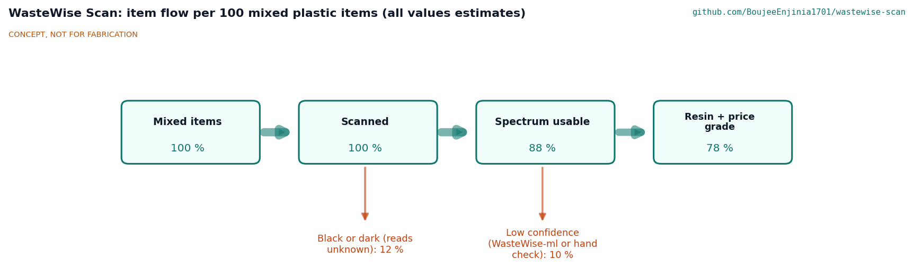
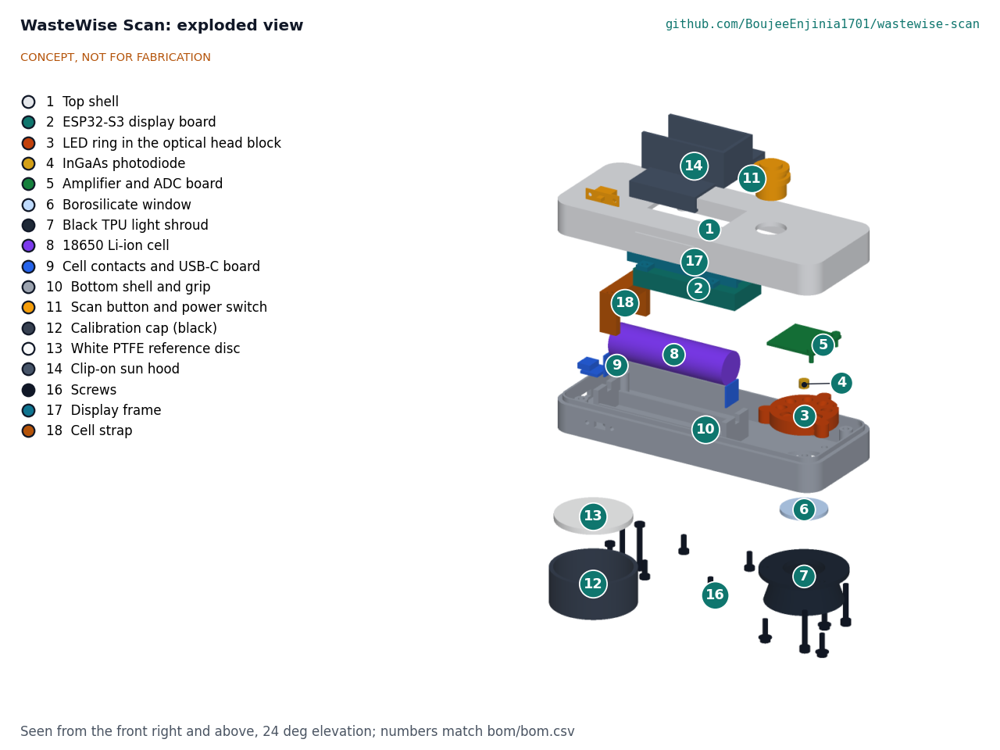
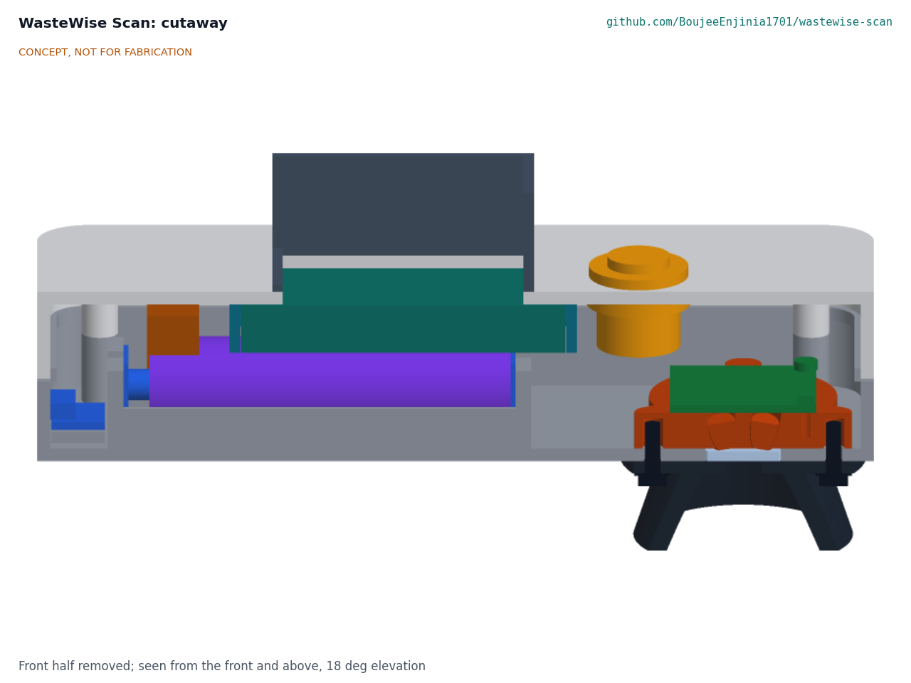

# WasteWise Scan design precis

WasteWise Scan is a palm-sized scanner that the user presses against a plastic item. It flashes eight near-infrared bands one after another, reads the reflection with an InGaAs photodiode, and in about 0.33 s shows the resin, a confidence mark and the local price grade. The calculation note WSC-CAL-001 v0.2 shows that it meets the speed, battery, mass, sunlight, logging, calibration, eye-safety and prototype cost requirements on paper. Clear and translucent items are backed with the black calibration cap in sun, and a clip-on sun hood shades the display (decisions accepted by Amish on 2026-09-25, WSC-DDR-003). Direct-sun legibility (R7) is at risk because the hood cannot shade every sun angle, and resin accuracy (R1) remains at risk near 1,700 nm. Value-engineering target: USD 150. Estimated cost of the constructable design: USD 167.50 (USD 17.50 over the target). Since 2026-10-02 the design is constructable (WSC-DDR-004, open for Amish's review): screws, a gasket, an optical head block, a cell cradle and strap, a display frame and clip legs on the hood were added, and the scanner now weighs about 254 g (274 g with the cap), so the 250 g mass requirement (R6) is not met. The prototype build plan is WSC-BLD-001 ([05-build-plan.md](05-build-plan.md)).

*Figure 1. Concept render from the parametric model. The grey hand and the blue crate panel are for scale only.*

## The sensor

The scaffold named an 18-channel AS7265x-class sensor. That chip covers about 410 to 940 nm ([SparkFun Triad board](https://www.sparkfun.com/products/15050)), which misses the polymer absorption bands near 1,150 to 1,250 nm and 1,650 to 1,750 nm that NIR sorters rely on (see WSC-PRB-001 and the review by [Neo et al. 2022](https://doi.org/10.1016/j.resconrec.2022.106217)). Amish decided on 2026-09-25 (WSC-DDR-001, D1) to use the approach of the open [Plastic Scanner](https://github.com/Plastic-Scanner) project instead: discrete NIR and short-wave infrared (SWIR) LEDs from 850 to 1,650 nm and one InGaAs photodiode ([Hackaday, 2021](https://hackaday.com/2021/12/13/an-open-source-detector-for-identifying-plastics/)). It is still a low-cost multispectral sensor, so the pitch is unchanged.

## How it works

1. **Press.** The user presses the soft black shroud against a flat or gently curved part of the item. The shroud blocks sunlight falling on the spot and fixes the item 22 mm from the detector.
2. **Illuminate and read.** On a button press the firmware pulses each of eight LEDs in turn (850, 940, 1,050, 1,200, 1,300, 1,450, 1,550 and 1,650 nm; WSC-DDR-001 D4). Each band reading sits between two dark readings, so slow changes in ambient light are subtracted. If the mean dark level exceeds 0.71 times the weakest band reading, which happens when sunlight passes through an unbacked clear item, the scanner shows "shade or back with cap" instead of a result (WSC-DDR-003 D8). The user then holds the black calibration cap behind the item and scans again. A transimpedance amplifier with 47 kΩ feedback and a 24-bit ADC take four conversions per reading. Eight bands and nine darks take about 240 ms.
3. **Normalize.** Readings have the window crosstalk offset from the last open-air reading subtracted (WSC-DDR-003 D11) and are divided by the last white reference taken in the calibration cap, giving a reflectance per band that is independent of LED aging and, to first order, temperature. A board temperature reading flags drift of more than 5 %, which takes about 12.5 °C of change.
4. **Classify.** A small classifier on the ESP32-S3 (linear discriminant analysis or a small decision tree on normalized band ratios; WSC-DDR-001 D5) returns a resin and a confidence. Below the confidence threshold, or when mean reflectance is under about 0.08 (black items), it shows "unknown".
5. **Show and log.** The display shows resin code, name, color and icon, plus the grade from the local price table. Each scan is logged as a 64-byte record for export over USB as CSV or JSON Lines.
6. **Hand off.** Unknown or low-confidence items can be photographed with a phone and passed to WasteWise-ml. The shared record proposed in WSC-DDR-002 lets the two results be joined on a pair ID.

*Figure 2. Item flow per 100 mixed plastic items. All values are estimates for concept review.*

## Main components

Table 1. Main components. Numbers match the BOM, the exploded view and drawing WSC-DWG-001.

| # | Component | Choice | Notes |
| --- | --- | --- | --- |
| 1 | Top shell | 3D-printed PETG with display window, button hole and eight insert bosses | Four M3 screws from below; foam gasket on the rim; about 51 g |
| 2 | Controller and display | ESP32-S3 board with 1.9 in IPS display and on-board Li-ion charger (LilyGO T-Display-S3 class) | No custom PCB (WSC-DDR-001 D3) |
| 3 | LED ring | Eight LEDs on a 20 mm pitch circle in a printed optical head block, each tilted about 23° so the beams meet on the item | SWIR LEDs dominate cost; the block also seats the photodiode and carries item 5 |
| 4 | Photodiode | InGaAs PIN photodiode, 1 mm, TO-46, about 900 to 1,700 nm, inside a short baffle tube | Standard InGaAs, cutoff near 1,700 nm |
| 5 | Amplifier and ADC | Low-noise op-amp transimpedance stage with 47 kΩ feedback, 24-bit ADC (ADS1220 class), LED switches | On perfboard for the first build |
| 6 | Window | Borosilicate glass disc, 25 mm, 2 mm | Keeps dust out; uncoated |
| 7 | Light shroud | Black TPU cone, 18 mm deep, 42 mm across the rim, 36 mm inside, with a 47 mm clamping flange | Blocks direct light, sets distance; its three screws clamp the window and head block |
| 8 | Battery | One protected 18650 Li-ion cell, 3,000 mAh | WSC-DDR-001 D7 |
| 9 | Cell contacts and USB-C | Spring and flat contacts in a cradle printed with the bottom shell; USB-C power board in the tail wall | A printed strap (item 18) holds the cell against about 550 N on a corner drop |
| 10 | Bottom shell and grip | 3D-printed PETG, textured grip, window hole, cell cradle, screw bosses | About 56 g |
| 11 | Scan button | Large sealed 16 mm push button for gloved hands | |
| 12, 13 | Calibration cap | Printed black PETG cap, 48 mm OD, with a 38 mm white PTFE reference disc; stores over the shroud | White reference (WSC-DDR-001 D6); also the backing for clear items in sun (WSC-DDR-003 D9) |
| 14 | Sun hood | Clip-on printed PETG hood, walls 20 mm high on both sides and at the head end of the display window, open toward the user; legs snap under ribs on the top shell | About 11 g and $1 (WSC-DDR-003 D10, WSC-DDR-004) |
| 17 | Display frame | Printed PETG frame holding the display board under the window | Four M3 screws into the top shell |
| 18 | Cell strap | Printed PETG bridge across the cell | Two M3 screws into floor bosses [J4] |
| 19 | Shell gasket | Closed-cell foam tape on the bottom shell rim | Squeezed to 0.6 mm; the bosses set the squeeze |

*Figure 3. Exploded view with BOM numbers.*

## Key numbers

All values are from WSC-CAL-001 (tags in brackets) and rest on the assumptions stated there.

Table 2. Key numbers.

| Quantity | Value | Requirement |
| --- | --- | --- |
| Scan time | about 0.33 s [E2] | R2 (1.5 s) met |
| Detected signal on the white reference | 0.35 to 5.2 µW, 10 to 115 mV at 47 kΩ [C2] | |
| Worst signal-to-noise ratio in shade | about 450 (clear item, 1,650 nm) [C4] | R1 needs about 200 |
| Sunlight through a clear item | about 23 µA, about 900 times the weakest signal [D1, D3] | Refused by the dark-level prompt [D7] |
| Ambient error, clear item backed with the cap | 0.36 % of signal [D6] | R4 met by estimate |
| Average power | about 0.39 W [F2] | |
| Battery life | about 22 h [F2] | R5 (8 h) met |
| Log capacity | about 131,000 scans at 64 B [G1] | R9 met |
| Mass | about 254 g, 274 g with cap [A3] | **R6 (250 g) not met** |
| Size | 160 x 62 x 34 mm (6.3 x 2.4 x 1.3 in), 72 mm high with shroud and sun hood, 68 mm wide over the hood legs [A1] | R6 size met |
| Display contrast in 100 klx sun | about 1.6:1 unshaded; 5.2:1 where the hood shades the screen [I1, I3, I4] | **R7 at risk** |
| LED irradiance at 200 mm | 3.9 W/m² against 100 W/m² [H2] | R14 met by estimate |
| Parts cost | USD 167.50 [K2] | USD 17.50 over the USD 150 value-engineering target |

## Key design choices

- **Discrete LEDs and one InGaAs photodiode rather than a spectrometer or a visible-range chip** (WSC-DDR-001 D1). A SWIR spectrometer module costs far more than the budget; a visible-range chip misses the polymer bands. Eight bands are kept because the six-band option (D2) needs a band study on reference spectra that has not been done.
- **Contact measurement through a shroud.** Pressing on the item fixes the geometry and removes direct light on the spot. It does not stop light passing through clear items, so clear and translucent items in sun are backed with the black cap and the firmware refuses a result when the dark level shows through-light (WSC-DDR-003 D8, D9).
- **Low gain and interleaved darks.** The 47 kΩ gain keeps sunlight through clear items inside the ADC range; interleaved dark readings cancel slow ambient changes. Faster changes are handled by the backing step; LED modulation at 2 kHz was checked on paper and does not remove the need for it (WSC-CAL-001 D8).
- **Say "unknown" rather than guess.** A wrong call can contaminate a bale; the confidence threshold is set for few false results, accepting more unknowns (R3).
- **White reference in the protective cap** (D6). The user calibrates by pressing the scanner into its own cap, at the start of a shift and again when the drift warning shows; the same routine takes an open-air reading to remove window crosstalk. The cap is printed in black so it can also back clear items.
- **Local price table on the device.** Grades are what matter to users, and prices are local and change often. The cooperative edits them; no cloud service is needed.
- **Clip-on sun hood** (WSC-DDR-003 D10). A printed hood shades the display for most sun angles at negligible cost; large color and icon cues stay the primary result.
- **One common 18650 cell** (D7). Available and replaceable in most markets; the board's charger keeps the build simple.

*Figure 4. Cutaway: LED ring, photodiode, amplifier board and window above the shroud, with the cell and controller behind.*

## Findings from the calculations and decisions taken

- **Clear items in sun (R4, now met by estimate).** Light passing through a clear or translucent item reaches the detector from inside the shroud, and hand movement changes it faster than dark subtraction can follow. Decided (WSC-DDR-003 D8, D9): back such items with the black cap (0.36 % error) and refuse a result when the dark level shows through-light. The classifier needs training data in this backed mode.
- **Display in direct sun (R7, now at risk).** A 400 cd/m² IPS screen washes out in 100 klx sun. Decided (D10): a clip-on sun hood, which gives about 5.2:1 on the shaded part but cannot shade the screen with the sun near its normal or over the open side.
- **Window crosstalk.** LED light reflected by the window's outer surface reaches the detector at about the same level as the item signal. Decided (D11): an open-air reading in the calibration routine subtracts it. Because a 10 % change from window dirt would leave about 10 % error, the fallback of a baffle extended through the glass (option (b)) is probably needed; that needs measurement at TRL 4.
- **PE versus PP (R1 at risk).** The 1,650 nm band is clipped by the detector cutoff and only samples the short edge of the 1,650 to 1,750 nm region. Whether to add an extended InGaAs band remains open (O3).

## Safety

> **Safety:** The scanner identifies plastic resin only. It must never be used to judge whether an item is safe to handle, or to classify hazardous, medical, chemical or pesticide containers. Waste handling carries cut, needle-stick and chemical risks: wear gloves and follow local guidance.

> **Safety:** Backing a clear item with the calibration cap puts the user's hand close to the item. Do not back sharp, broken or contaminated items by hand; scan them in shade instead.

> **Safety:** The 18650 lithium-ion cell stores about 11 Wh. Use a protected cell from a known supplier, charge with the board's charger only, do not charge in direct sun or above 45 °C, and stop using a cell that is dented, swollen or wet. The cradle must hold the cell firmly in a drop. Do not leave the device on hot surfaces or in closed vehicles.

> **Safety:** The SWIR LEDs are invisible to the eye, so a user cannot tell when they are on. In normal use they fire for about 14 ms each per scan, which keeps emission far inside the IEC 62471 exempt group by estimate (WSC-CAL-001, H). An LED stuck on at the shroud rim could exceed the corneal limit over long exposures, so the LED drivers need a hardware limit on on-time that firmware cannot override. Do not look into the window during a scan.

- Black and dark items read "unknown". Users must not treat "unknown" as any particular resin.
- The result is advice for sorting, not a certificate of material grade for sale.

## Open questions

1. **First users and region** for co-design and the first price table. Proposed, awaiting Amish (WSC-DDR-001 O1).
2. **Who the $150 volume target is for:** cooperatives or individual pickers. Proposed, awaiting Amish (O2).
3. **Extended InGaAs band.** Whether to add a 1,700 to 1,750 nm band to separate PE from PP. Proposed, awaiting Amish (O3).
4. **Scan record format.** One shared record with a `pair_id` join was decided on this side on 2026-09-25 (WSC-DDR-002 v0.2, WSC-DDR-003 D12); WasteWise-ml has still to adopt it, and how `pair_id` is created in the field is open.
5. **Band study.** A paper study on published reference spectra to confirm the band set and whether six bands suffice (WSC-DDR-001 D2, D4). Not yet done.

Concept media: [blueprint sheet](../media/concept-blueprint.pdf), [interactive 3D model](../media/viewer.html). General arrangement: [WSC-DWG-001](../cad/drawings/WSC-DWG-001.pdf).
