# WasteWise Scan prototype build plan

**Plan, not yet built.** How to build the first proof-of-concept prototype, component by component. Building and testing to it is TRL 4 work. Decisions still to be made are kept in the design decisions register ([docs/06-design-decisions.md](06-design-decisions.md)), not here.

## 1. What you are building

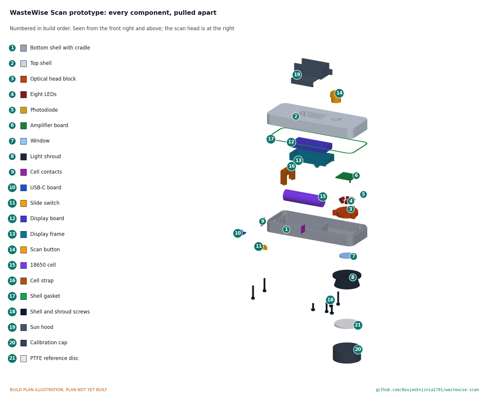

*Figure 1. Every component pulled apart and numbered in build order.*

The prototype is one handheld scanner about the size of a large phone, 160 x 62 x 34 mm, with a soft black cone underneath at the head end that is pressed against a plastic item. Inside, eight infrared LEDs and one photodiode sit in a printed block above a glass window; a small hand-built amplifier board reads the photodiode; a bought display board shows the result; one 18650 cell powers it all. Figure 1 shows the 21 components in the order you fit them. Eight are 3D printed (the two shells, the optical head block, the light shroud, the display frame, the cell strap, the sun hood and the calibration cap), one is cut from PTFE sheet and one is cut and drilled from perfboard. Everything else is bought: the window, LEDs, photodiode, cell and its contacts, display board, USB-C board, button, switch, foam gasket and screws. The work is 3D printing in PETG and TPU, pressing brass inserts in with a soldering iron, through-hole soldering and small screws. The parts cost about USD 168 from the bill of materials.

> **Safety:** The prototype holds a lithium-ion cell of about 11 Wh. Keep the cell out of the scanner until the stops in section 6 are passed, never charge it in direct sun or above 45 °C, and never leave a first build charging unattended. The infrared LEDs are invisible: never look into the window while the scanner is powered. A soldering iron at 230 °C is used to set inserts; use a stand and keep the work clamped. The scanner identifies plastic resin only; it must never be used to judge whether waste is safe to handle.

## 2. What changed to make it buildable

The concept showed what the scanner does; most of its parts had no fixing, and a few could not do their job as drawn. Each change below keeps what the scanner does: the body size, the optical layout and distances, the electronics and the calibration method are unchanged. All of them are recorded in decision record WSC-DDR-004, open for Amish's review.

*Table 1. Changes from the concept.*

| Component | The concept had | The buildable design has | Why |
| --- | --- | --- | --- |
| Shells | Two halves touching, with no screws, seal or location | Four screws from below into brass inserts; bosses that meet; a foam gasket on the rim; a tongue that lines up the halves (Figure 5) | The halves close square and sealed, and the gasket cannot be over-squeezed |
| Window | A loose disc in a hole through the floor | Pinched between the shroud flange below and the baffle tube of the head block above (Figure 8) | One clamp holds the window, the shroud and the head block |
| Light shroud | A cone touching the underside, not fixed | A flange with three screws into the head block (Figures 8 and 11) | Held firm, and replaceable when it wears |
| LED holder and amplifier board | A ring floating above the floor, and a board floating above it | An optical head block from the floor to the board, which carries the LEDs, the photodiode and the board (Figure 7) | Every optical part is located by one printed part |
| Cell holder | An open trough for an unprotected cell, with no contacts and nothing holding the cell | A cradle printed with the bottom shell, with contacts for a protected cell and a printed strap over the cell (Figure 15) | The cell stays put in a drop and the contacts have somewhere to sit |
| Display board | No fixing | A printed frame with lips under the board, screwed into the top shell (Figure 13) | The board has no mounting holes of its own |
| Scan button | A hole too small for the button | A 16.2 mm hole for a panel-mount button, nut inside (Figure 6) | Standard fitting with its own seal |
| USB-C socket and switch | Socket overlapping the tail wall; no switch in the model | A USB-C board on a printed seat; a slide switch in the right-hand wall (Figure 3) | Both are reachable and fixed |
| Sun hood | Called clip-on, with nothing to clip to | Two clip legs that snap under ribs on the top shell sides (Figure 17) | No tools; the shading walls are unchanged |
| Calibration cap | Loose on the shroud, too deep for the rim to touch the white disc | A tighter bore that grips the rim, a shorter cap and a wider disc, so the rim rests on the disc (Figure 19) | The white reference is read at the same distance as an item |

## 3. Making the components

Make and check each component before the assembly step that needs it. Sizes are in millimetres. "Head end" is the end with the window and cone; "tail" is the end with the USB-C socket; "left" and "right" are as seen holding the scanner with the display up and the head end pointing away from you. Print in PETG unless a section says otherwise. Workshop tolerance is 0.2 mm on printed parts and 0.5 mm elsewhere; drawings do not carry tolerances before TRL 4.

### 3.1 Bottom shell, with its cradle

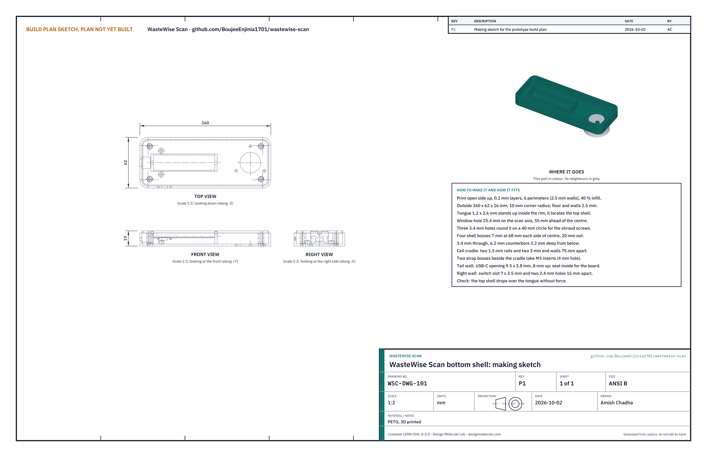

*Figure 2. Bottom shell making sketch (WSC-DWG-101).*

**What it is and what it is made from.** The lower half of the body and the grip, with the cell cradle, the screw bosses and the window hole printed in. PETG, printed open side up.

**How to make it.**

1. Print open side up with 0.2 mm layers, six perimeters (so the 2.5 mm walls are solid) and 40 % infill. Support is needed only under the USB-C opening.
2. Check the window hole: a 25.4 mm hole through the floor, 55 mm ahead of the body centre on the centre line. The window must drop in with a little play.
3. Clear the three 3.4 mm holes round the window hole (on a 40 mm circle) and the four 3.4 mm holes through the corner bosses with a drill by hand.
4. Check the four counterbores on the underside: 6.2 mm across and 3.2 mm deep, so the screw heads sit below the surface.
5. Press an M3 heat-set insert into each of the two small bosses beside the cradle, with the iron at about 230 °C, square and flush.
6. Clear the slot in the right-hand wall (7 x 3.5 mm) and its two 2.4 mm screw holes, and the USB-C opening in the tail wall (9.5 x 3.8 mm).

**How it fits the parts next to it.** The cradle takes the cell and its contacts; the head block stands on the floor over the window hole; the shroud screws to the underside; the top shell drops over the tongue on the rim. At the tail, the USB-C board sits on its seat with its socket in the opening, and the switch sits against the inside of the right-hand wall:

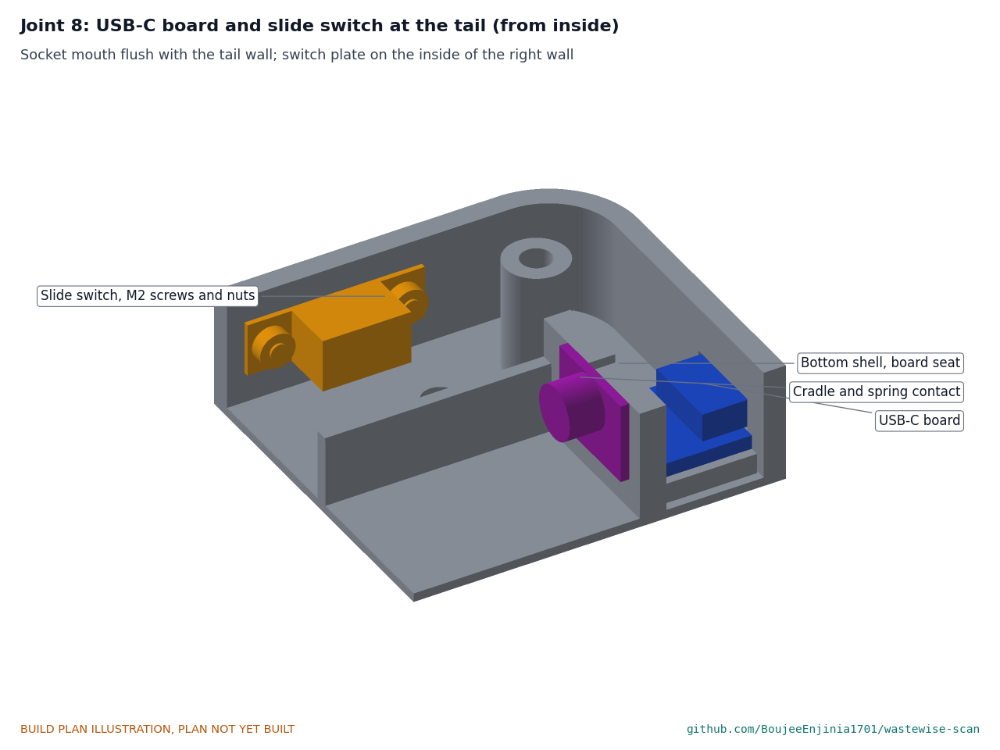

*Figure 3. Joint 8: the USB-C board on its seat and the slide switch on the inside of the right-hand wall, seen from inside.*

**Check before moving on.** The floor is flat within 0.3 mm (the head block must sit on it without rocking); a 69 mm cell drops into the cradle between the end walls with about 6 mm to spare for the contacts.

### 3.2 Top shell

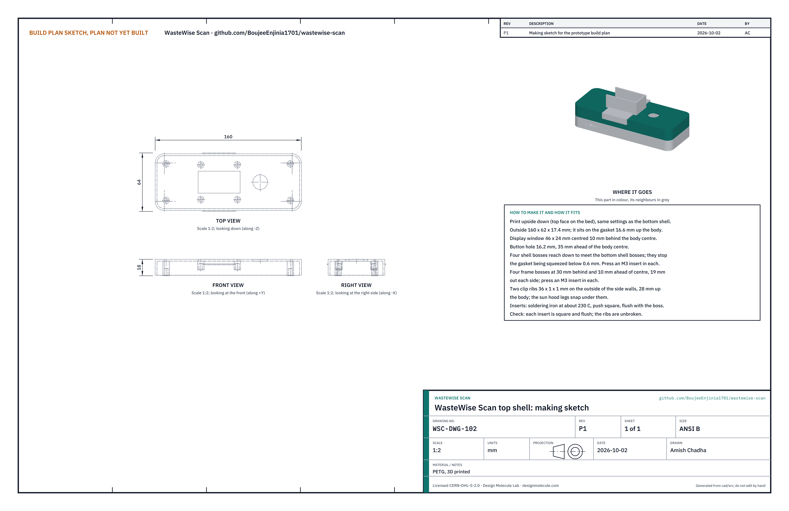

*Figure 4. Top shell making sketch (WSC-DWG-102).*

**What it is and what it is made from.** The upper half of the body, with the display window, the button hole, eight bosses for inserts and the two ribs the sun hood clips under. PETG, printed upside down (top face on the bed).

**How to make it.**

1. Print top face down, with the same settings as the bottom shell. The bosses grow up from the ceiling and need no support.
2. Check the display window (46 x 24 mm) and the button hole (16.2 mm, 35 mm ahead of the body centre).
3. Press an M3 heat-set insert into each of the eight bosses: four at the corners for the shell screws, four near the display for the frame screws.
4. Check the two ribs on the outside of the side walls are whole along their 36 mm length.

**How it fits the parts next to it.** The corner bosses reach down past the rim and meet the bottom shell's bosses face to face, which sets the gasket squeeze; the rim sits on the gasket; the tongue of the bottom shell sits just inside its walls:

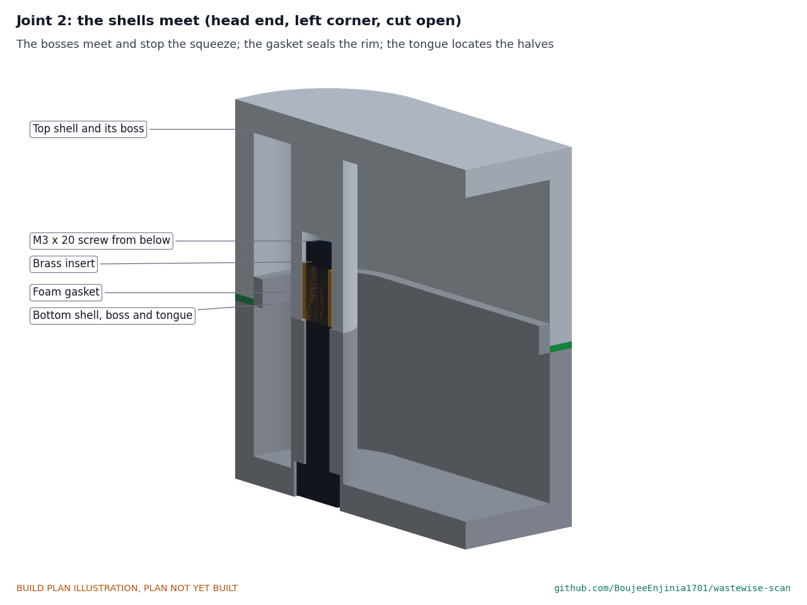

*Figure 5. Joint 2: the screw comes up through the bottom shell boss into the insert in the top shell boss; the bosses meet; the gasket is squeezed to 0.6 mm between the rims; the tongue lines the halves up.*

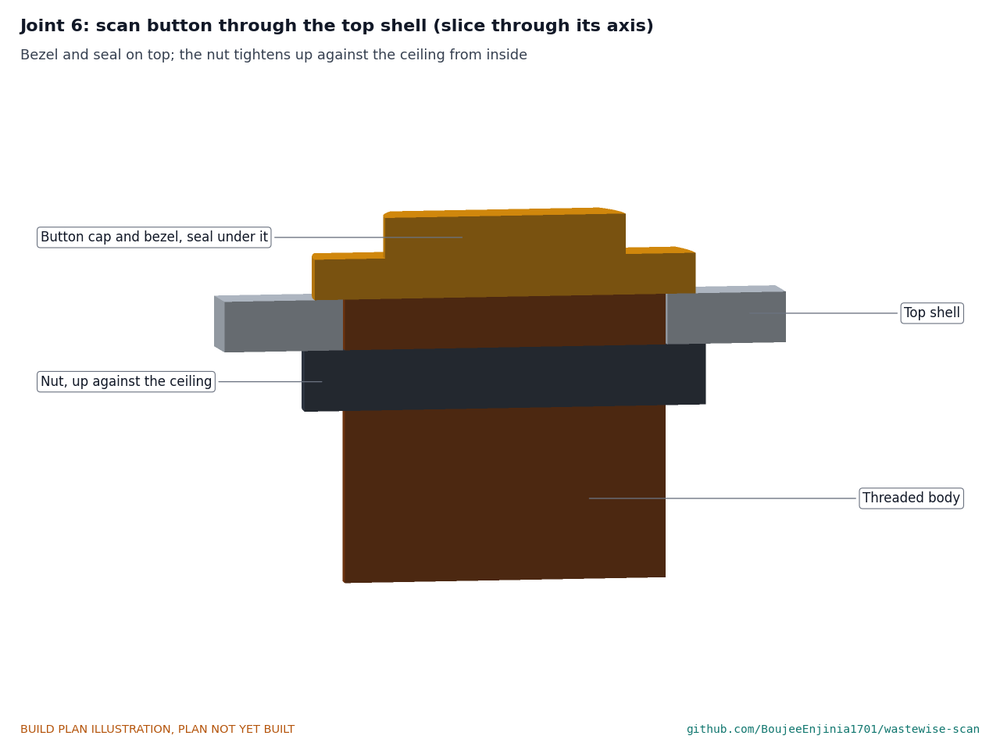

*Figure 6. Joint 6: the button goes in from outside with its seal under the bezel, and its nut tightens up against the ceiling from inside.*

**Check before moving on.** The top shell sits on the bottom shell over the tongue, without the gasket, with the corner bosses touching and the rims about 0.6 mm apart all round.

### 3.3 Optical head block, with its LEDs and photodiode

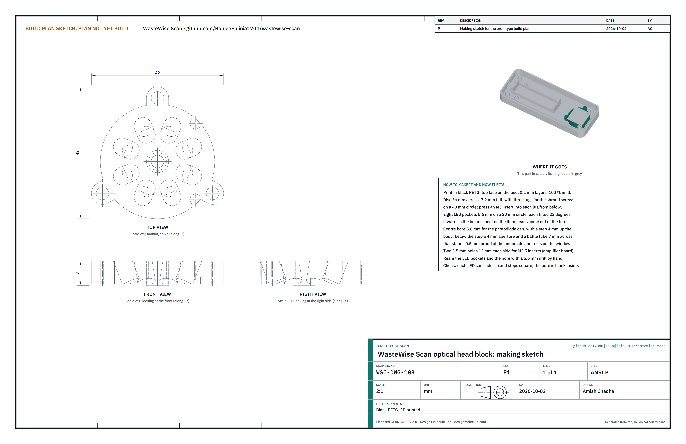

*Figure 7. Optical head block making sketch (WSC-DWG-103).*

**What it is and what it is made from.** The printed block that holds the eight LEDs at the right angle, holds the photodiode above the window, keeps stray light away from it, and carries the amplifier board. Black PETG, 100 % infill.

**How to make it.**

1. Print in black PETG with its top face on the bed, 0.1 mm layers, 100 % infill.
2. Ream the eight LED pockets and the centre bore by hand with a 5.6 mm drill held in a pin vice.
3. Press an M3 insert into each of the three lugs from the underside, and an M2.5 insert into each of the two holes on the top face nearest the head end.
4. Push each LED can into its pocket from the top until it stops square (the pocket is a close fit), and the photodiode can into the centre bore until it sits on the step. Fit the bands in a fixed order round the ring and mark it on the block.

**How it fits the parts next to it.** The block stands on the floor of the bottom shell with its three lugs over the three holes round the window. Its baffle tube stands 0.5 mm below its underside and rests on the window, so light from the LEDs cannot reach the photodiode through the glass without going out to the item first. The amplifier board sits on its top face:

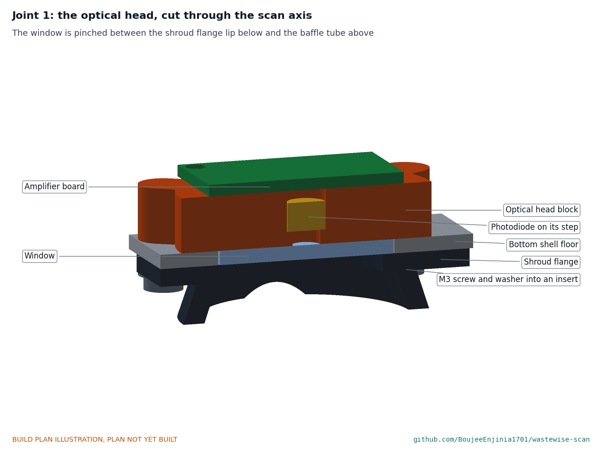

*Figure 8. Joint 1: the shroud flange lip holds the window up from below and the baffle tube holds it down from above; three screws through the flange and the floor pull the shroud, window and head block together.*

**Check before moving on.** Every can is seated square; the block stands on a flat surface without rocking; looking down the centre bore you see light only through the 4 mm aperture.

### 3.4 Amplifier board

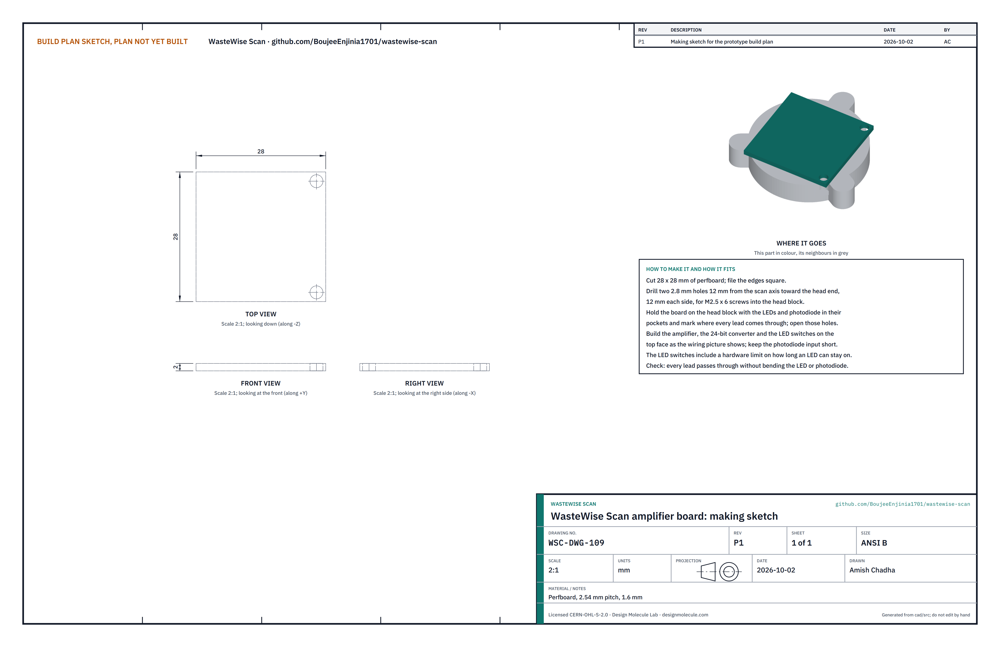

*Figure 9. Amplifier board making sketch (WSC-DWG-109).*

**What it is and what it is made from.** A 28 x 28 mm square of perfboard carrying the photodiode amplifier, the 24-bit converter and the LED switches, sitting on top of the head block so the photodiode leads are as short as possible. Perfboard with 2.54 mm pitch, 1.6 mm thick.

**How to make it.**

1. Cut the square and file the edges.
2. Drill two 2.8 mm holes 12 mm toward the head end from the scan axis and 12 mm each side of it.
3. Hold the board on the head block with the LEDs and photodiode in place, mark where each lead comes up, and open those holes.
4. Build the circuit on the top face as Figure 10 shows: the photodiode amplifier with a 47 kΩ feedback resistor, the 24-bit converter, and one constant-current switch per LED with a hardware limit on how long any LED can stay on.

#### 3.4.1 Wiring

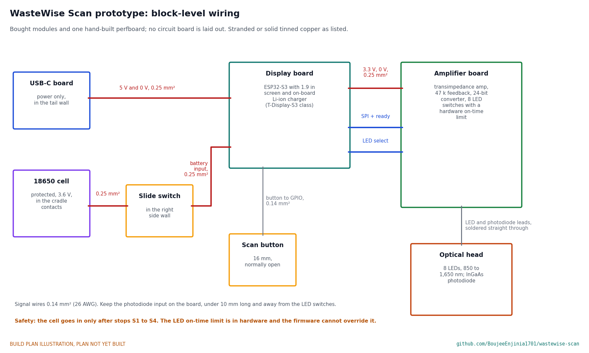

*Figure 10. Block-level wiring with wire sizes. No circuit board is laid out at this stage.*

Wire it like this:

1. USB-C board to the display board's 5 V and 0 V pins, so the board's own charger charges the cell: 0.25 mm² (24 AWG).
2. Cell contacts to the slide switch, and the switch to the display board's battery input: 0.25 mm². Charging needs the switch on.
3. Display board 3.3 V and 0 V to the amplifier board: 0.25 mm².
4. Display board to the converter (four data wires and a ready line) and to the LED select lines: 0.14 mm² (26 AWG), twisted with a 0 V wire where possible.
5. Scan button to a free input pin and 0 V: 0.14 mm².
6. LED and photodiode leads go straight through the amplifier board and are soldered there; keep the photodiode input under 10 mm long and away from the LED switches.

Leave every lead about 60 mm long so the two shells can lie side by side while you work.

**Check before moving on.** Every wire continues end to end; with no cell fitted, the cell contacts read open to every other node; every LED lights on a camera without an infrared filter (an old phone camera) when its switch is driven from a bench supply through a 100 Ω resistor.

### 3.5 Light shroud

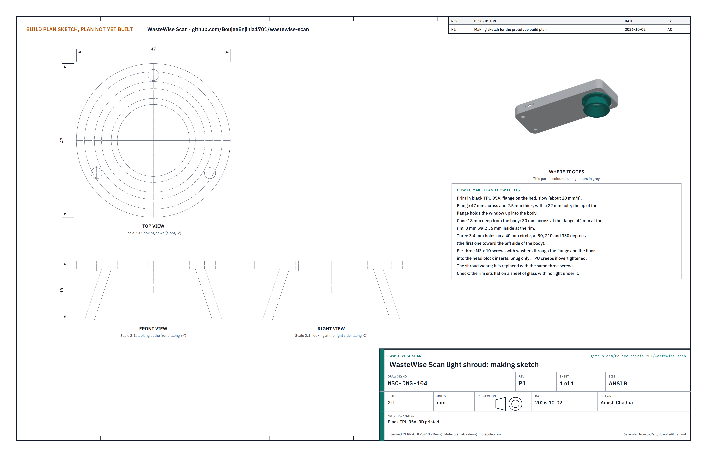

*Figure 11. Light shroud making sketch (WSC-DWG-104).*

**What it is and what it is made from.** The soft black cone pressed against the item. It blocks direct light, sets the distance from the detector to the item at 22 mm, and its flange holds the window. Black TPU 95A.

**How to make it.**

1. Print in black TPU, flange on the bed, slowly (about 20 mm/s), 100 % infill.
2. Check the flange: 47 mm across, 2.5 mm thick, with a 22 mm hole in the middle and three 3.4 mm holes on a 40 mm circle.
3. Check the cone: 18 mm deep from the underside of the body, 42 mm across the rim with a 3 mm wall.

**How it fits the parts next to it.** The flange lies flat on the underside of the body round the window hole; its lip covers the outer 1.5 mm of the window (Figure 8). Three M3 x 10 screws with washers go through the flange and the floor into the head block's inserts. Tighten them only until the flange is flat: TPU creeps if overtightened.

**Check before moving on.** Pressed on a sheet of glass over a bright lamp, no light shows under the rim.

### 3.6 Display frame

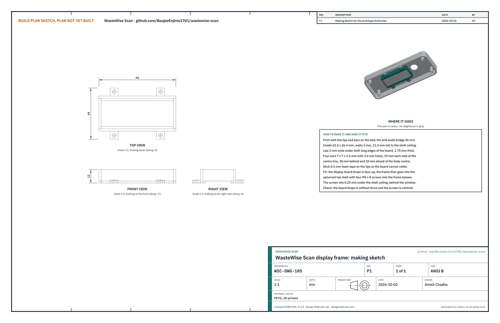

*Figure 12. Display frame making sketch (WSC-DWG-105).*

**What it is and what it is made from.** A printed frame that holds the bought display board under the display window. PETG.

**How to make it.**

1. Print with the lips and ears on the bed; the two short end walls bridge across 26 mm.
2. Check the inside is 62.4 x 26.4 mm and the board drops in.
3. Stick 0.5 mm foam tape on top of both lips.

**How it fits the parts next to it.**

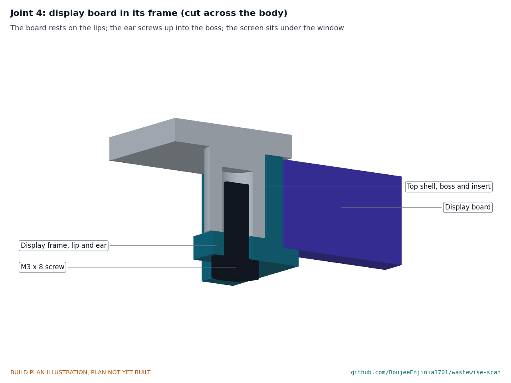

*Figure 13. Joint 4: the board rests on the lips; each ear takes an M3 x 8 screw up into an insert in the top shell boss; the screen sits 0.25 mm under the ceiling, behind the window.*

**Check before moving on.** With the board in, the screen sits centred in the display window when the frame is held in place.

### 3.7 Cell strap

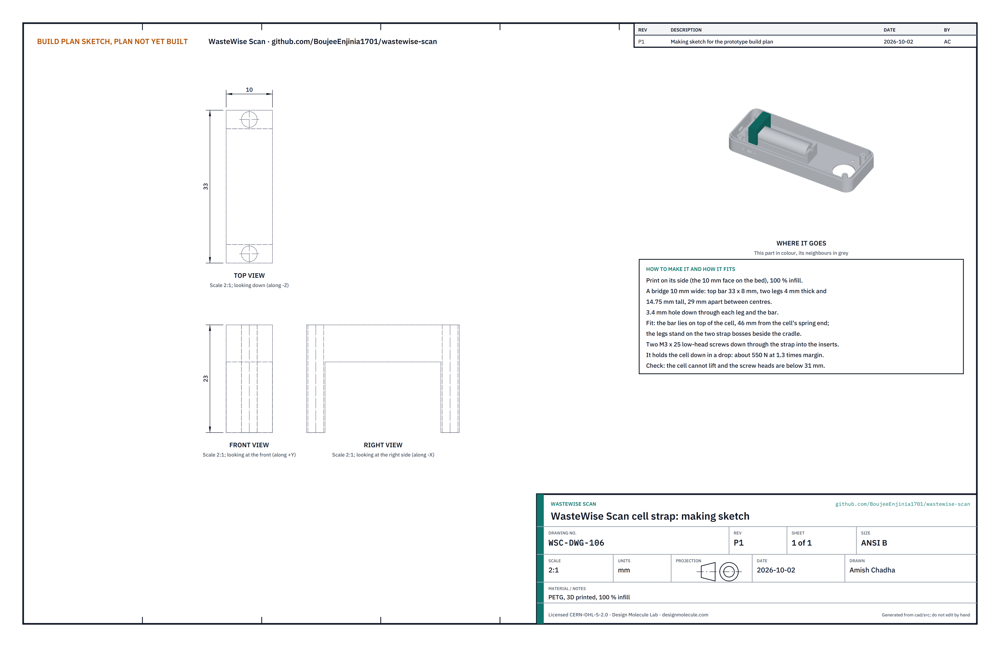

*Figure 14. Cell strap making sketch (WSC-DWG-106).*

**What it is and what it is made from.** A printed bridge across the cell that stops it lifting out of the cradle in a drop. PETG, 100 % infill.

**How to make it.**

1. Print on its side (the 10 mm face on the bed), 100 % infill, so the layers run along the bar.
2. Clear the 3.4 mm hole down through each leg.

**How it fits the parts next to it.**

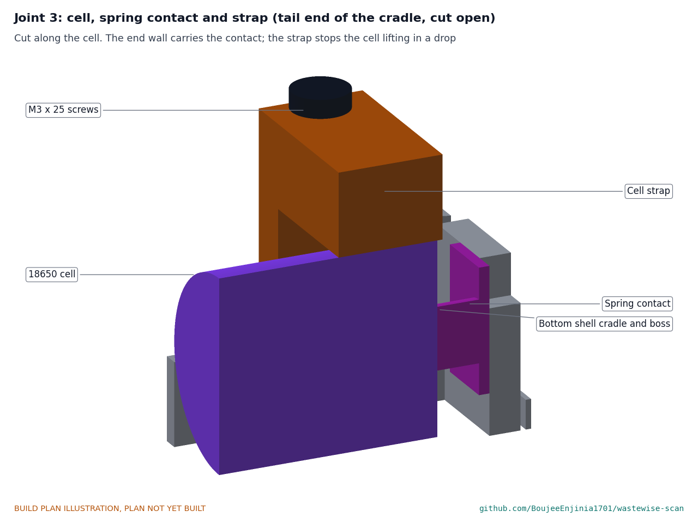

*Figure 15. Joint 3: the spring contact sits in the tail end wall of the cradle; the strap bar lies on the cell and its legs stand on the two bosses beside the cradle.*

The bar lies on top of the cell near its tail end; two M3 x 25 low-head screws go down through the legs into the inserts in the floor bosses. Their heads stay below the top shell ceiling.

**Check before moving on.** With the strap screwed down, the cell cannot be lifted and does not rattle.

### 3.8 Sun hood

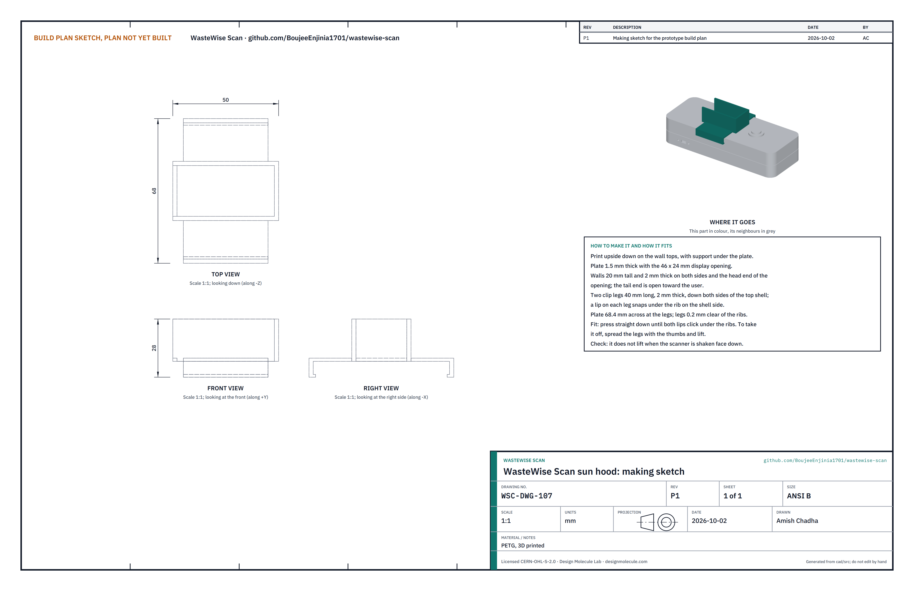

*Figure 16. Sun hood making sketch (WSC-DWG-107).*

**What it is and what it is made from.** A clip-on hood that shades the display from the sun on both sides and at the head end, open toward the user. PETG.

**How to make it.**

1. Print upside down, standing on the top edges of its walls, with support under the plate.
2. Remove the support and file the plate's underside flat.
3. Check the lips at the bottom of the two legs are whole.

**How it fits the parts next to it.**

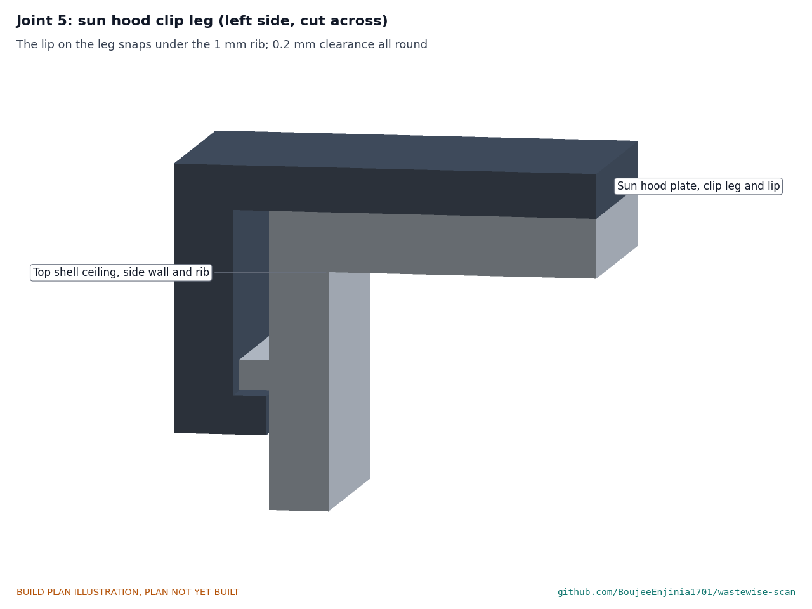

*Figure 17. Joint 5: the plate sits on the top shell; the lip at the bottom of each leg snaps under the rib on the shell side, with 0.2 mm clearance.*

**Check before moving on.** It clicks on and off by hand and does not lift when the scanner is shaken face down.

### 3.9 Calibration cap and PTFE disc

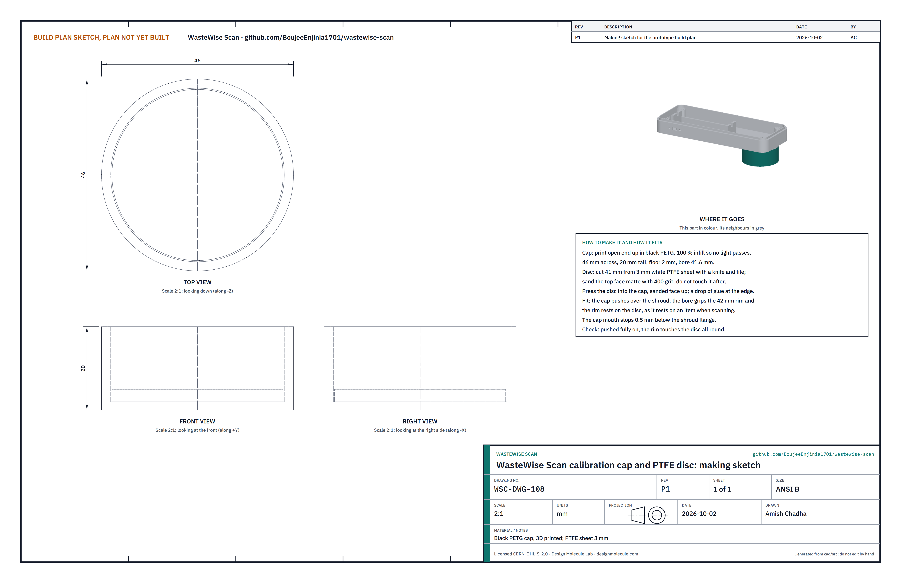

*Figure 18. Calibration cap and PTFE disc making sketch (WSC-DWG-108).*

**What it is and what it is made from.** A black cap with a white PTFE disc in its floor. It protects the shroud when stored, gives the white reference for calibration, and backs clear items in sun. Black PETG at 100 % infill, so no light passes; white PTFE sheet 3 mm thick.

**How to make it.**

1. Print the cap open end up: 46 mm across, 20 mm tall, 2 mm floor, 41.6 mm bore.
2. Cut a 41 mm disc from the PTFE sheet with a sharp knife against a template, and file the edge round.
3. Sand the top face matte with 400 grit paper, then do not touch it.
4. Press the disc into the cap, sanded face up, with a small drop of glue at the edge only.

**How it fits the parts next to it.**

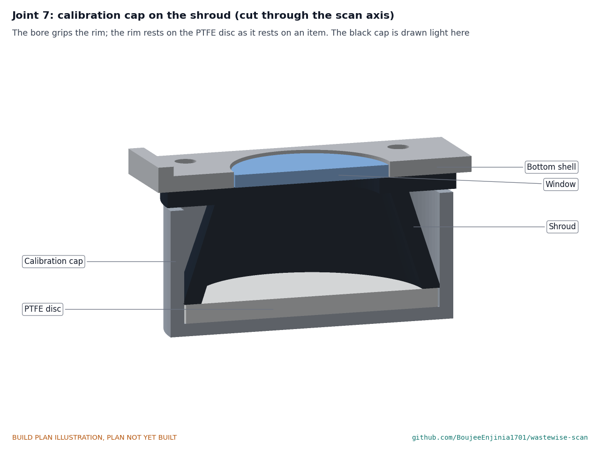

*Figure 19. Joint 7: the bore grips the shroud rim; the rim rests on the disc, as it rests on an item when scanning; the cap mouth stops just short of the flange.*

**Check before moving on.** Pushed fully on, the rim touches the disc all round (check by eye through the gap at the flange) and the cap does not fall off when shaken.

### 3.10 Bought components

Buy to specification, not brand. Line numbers are those of the bill of materials.

- **Display board (line 2).** ESP32-S3 board with a 1.9 in display and an on-board lithium-ion charger, about 62 x 26 x 9.5 mm (T-Display-S3 class).
- **LEDs (line 3).** One each at 850, 940, 1,050, 1,200, 1,300, 1,450, 1,550 and 1,650 nm, in TO-46 cans 5.4 mm across. A band available only as a 5 mm lens LED needs its pocket opened to suit its 5.8 mm rim.
- **Photodiode (line 4).** InGaAs PIN, 1 mm active area, about 900 to 1,700 nm, TO-46 can.
- **Amplifier parts (line 5).** Low-noise op-amp, 47 kΩ feedback resistor, 24-bit converter on a breakout (ADS1220 class), eight constant-current LED switches.
- **Window (line 6).** Borosilicate disc 25 mm across, 2 mm thick, uncoated.
- **Cell (line 8).** One protected 18650 lithium-ion cell, 3,000 mAh, button top, about 69 mm long, from a named cell maker.
- **Cell contacts and USB-C board (line 9).** A spring and flat contact pair for 18650 cells with solder tabs; a power-only USB-C board about 10 x 12 mm.
- **Button and switch (line 11).** Sealed 16 mm panel-mount push button with an M16 thread and nut; panel slide switch with two M2 holes 15 mm apart.
- **Shell gasket (line 19).** Closed-cell EPDM foam tape 2.5 mm wide, 1.5 mm thick, about 0.45 m.
- **Fixings (line 16).** Stainless pan-head screws: 4 x M3 x 20, 3 x M3 x 10 with washers, 4 x M3 x 8, 2 x M3 x 25 low head, 2 x M2.5 x 6, 2 x M2 x 6 with nuts; 13 M3 and 2 M2.5 brass heat-set inserts; wire in the sizes of section 3.4.1; 0.5 mm foam tape; glue.

## 4. Putting it together

In each picture the parts already fitted are grey and the parts being fitted are in colour, with an arrow showing the way they go in.

### Step 1: heat-set inserts

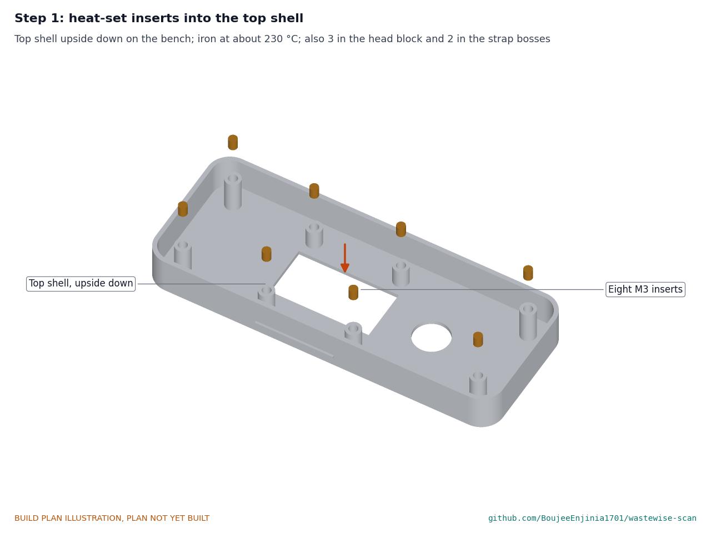

Top shell upside down on the bench. Press the eight M3 inserts in with the iron at about 230 °C, square and flush. Do the same for the three M3 and two M2.5 inserts in the head block and the two M3 inserts in the strap bosses of the bottom shell, if not already done.

### Step 2: LEDs and photodiode into the head block

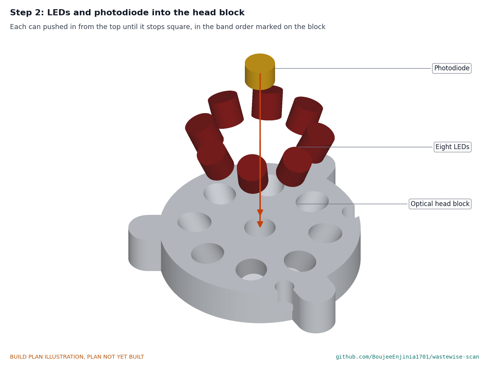

Each can pushed in from the top until it stops square, in the band order marked on the block.

### Step 3: amplifier board onto the head block

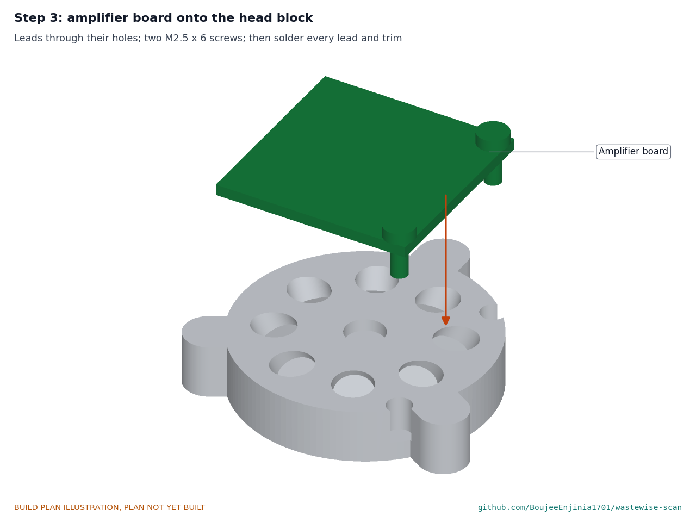

Thread the leads through their holes, fit two M2.5 x 6 screws, then solder every lead and trim. **Hold point:** the wiring checks of section 3.4 for the board pass before going on.

### Step 4: window and head block into the bottom shell

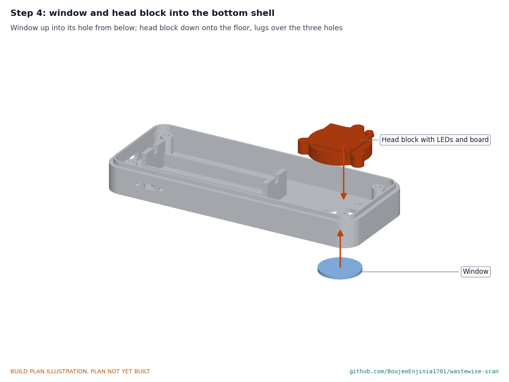

Clean the window and drop it into its hole from below; stand the head block on the floor with its lugs over the three holes, so the baffle tube rests on the glass.

### Step 5: shroud and head screws from below

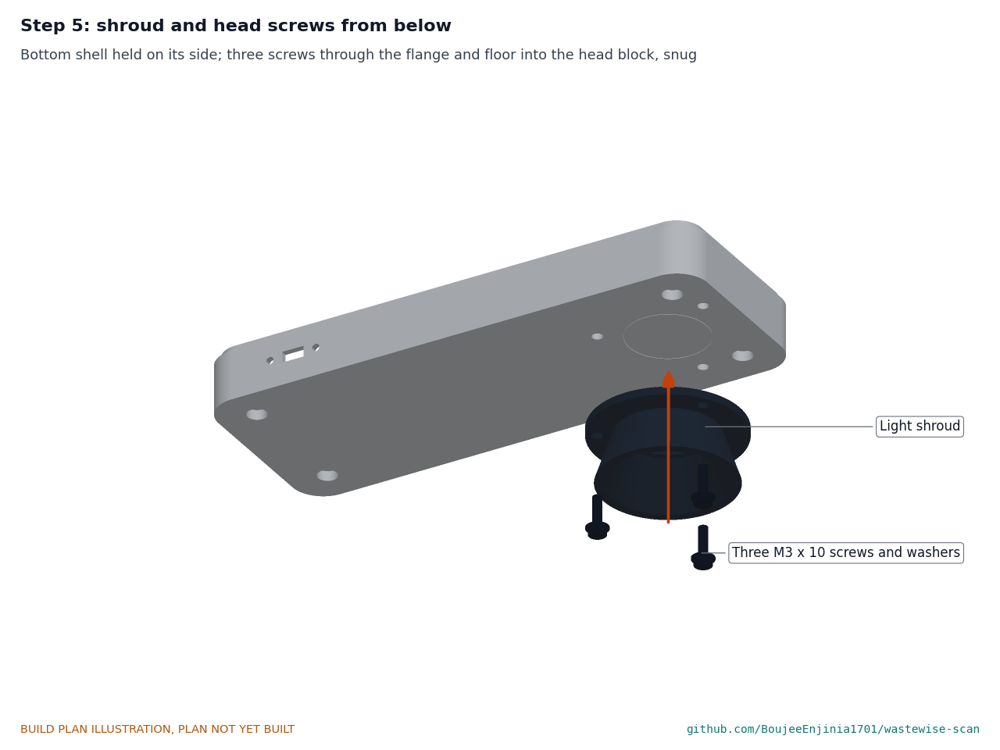

Hold the bottom shell on its side so the window cannot fall out. Three M3 x 10 screws with washers through the flange and floor into the head block, snug.

### Step 6: cell contacts, USB-C board and slide switch

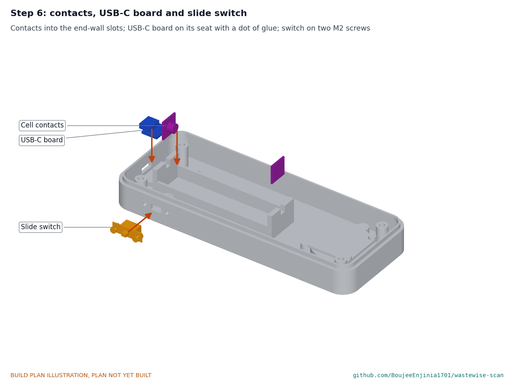

Push the contacts into the slots in the cradle end walls, spring at the tail end. Glue the USB-C board to its seat with its socket flush in the tail opening. Fit the switch with two M2 x 6 screws from outside and nuts inside.

### Step 7: display board and frame into the top shell

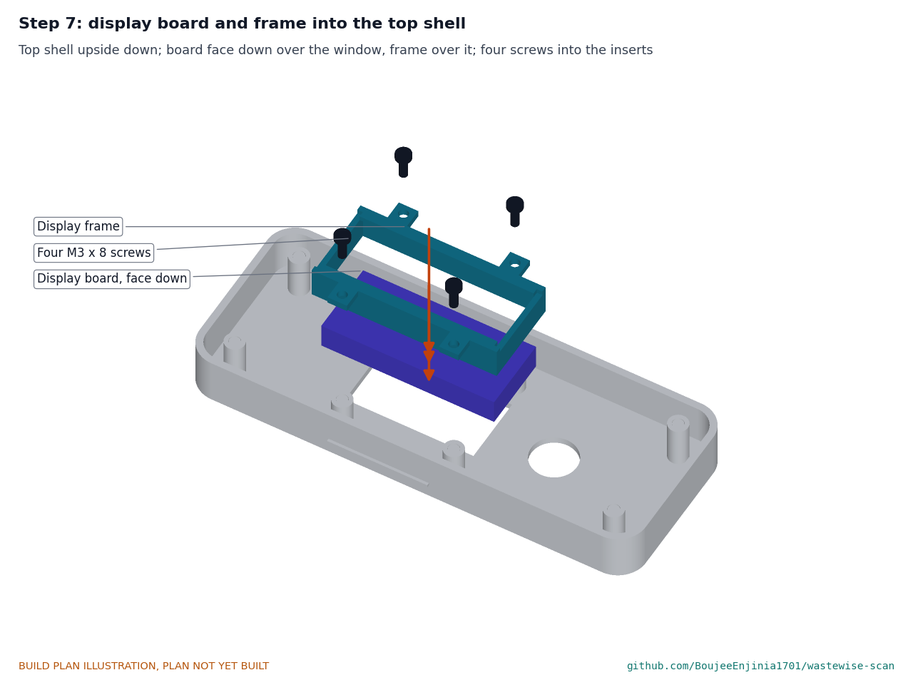

Top shell upside down. Lay the display board face down over the window, put the frame over it, and fit four M3 x 8 screws through the ears into the inserts.

### Step 8: scan button into the top shell

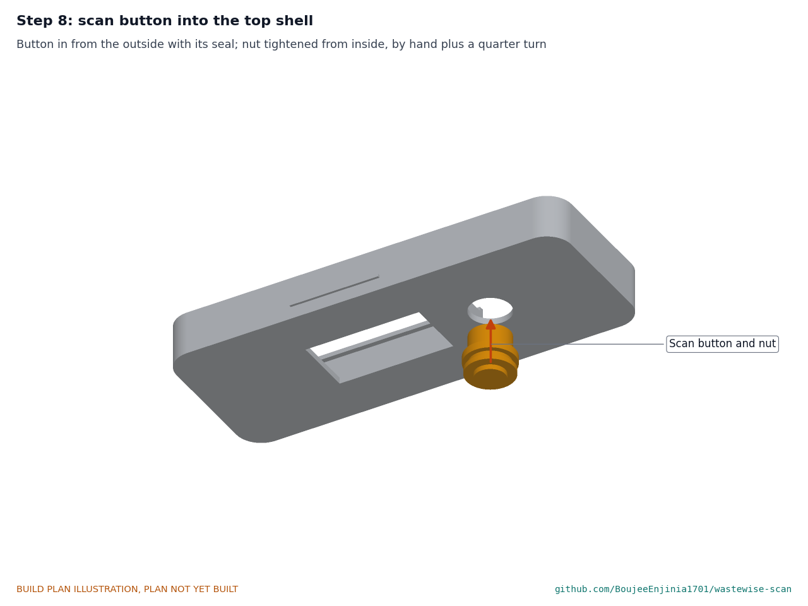

Button in from outside with its seal under the bezel; nut tightened from inside by hand plus a quarter turn. Then wire everything as section 3.4.1. **Hold point:** safety stops S1 to S4 in section 6 are passed before the cell goes in.

### Step 9: cell and strap

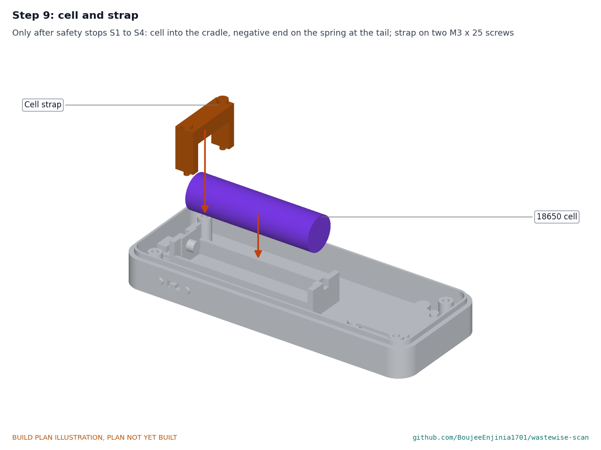

Switch off. Cell into the cradle with its flat (negative) end against the spring at the tail. Strap over the cell on two M3 x 25 screws.

### Step 10: gasket onto the rim

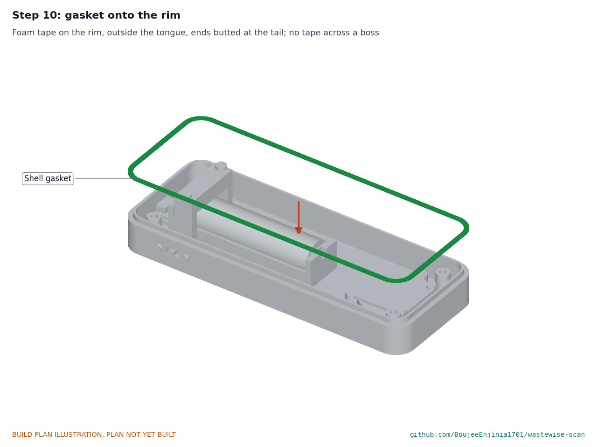

Stick the foam tape round the rim of the bottom shell, outside the tongue, starting and ending at the tail with the ends butted.

### Step 11: close the shells

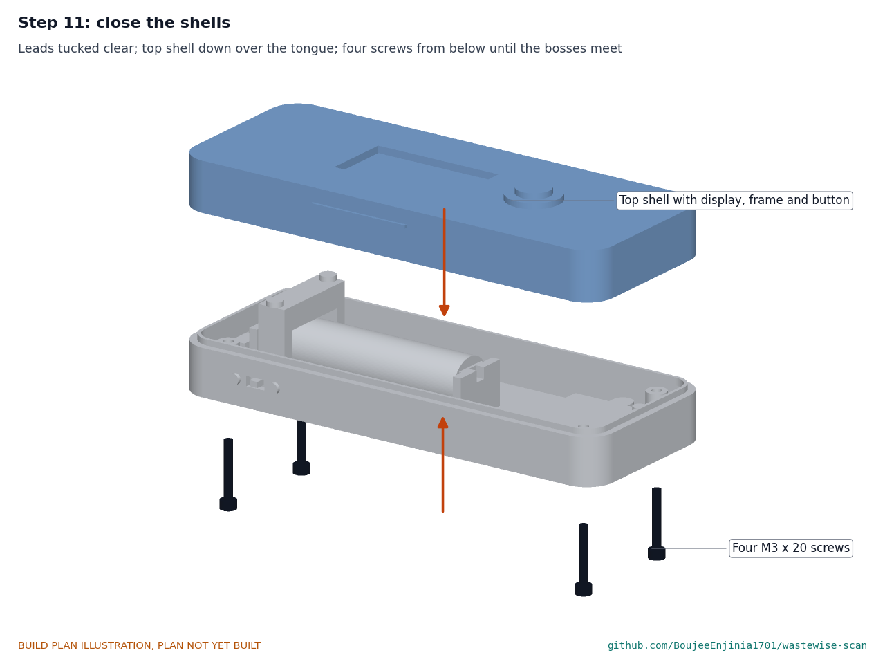

Fold the leads in clear of the rim, lower the top shell over the tongue and fit four M3 x 20 screws from below, tightening in a cross pattern until the bosses meet.

### Step 12: clip on the sun hood

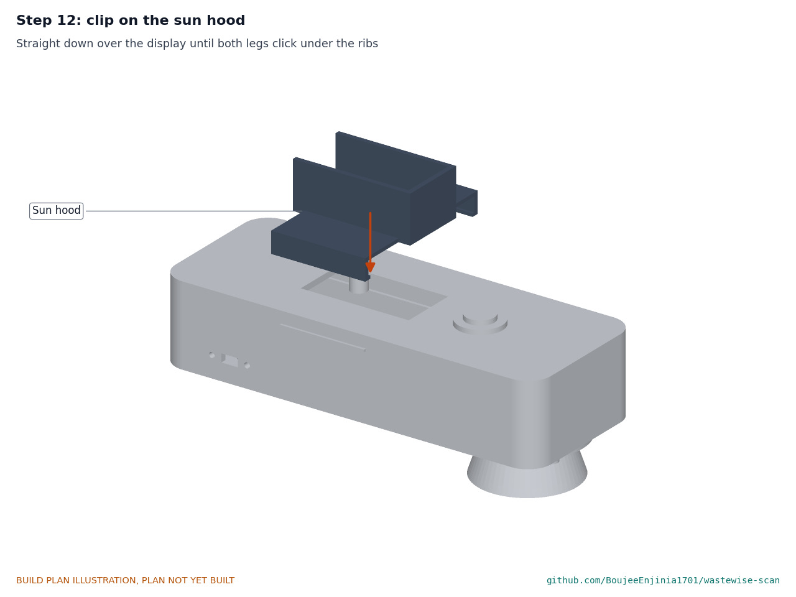

Straight down over the display until both legs click under the ribs.

### Step 13: calibration cap onto the shroud

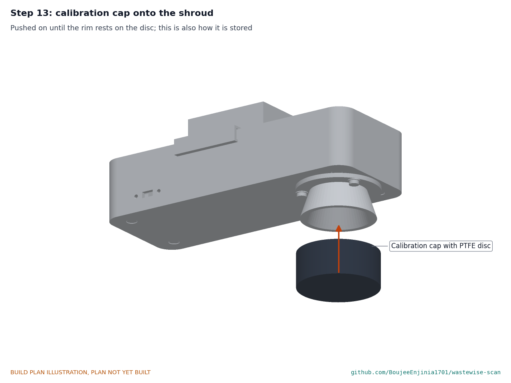

Push the cap on until the rim rests on the disc. This is how the scanner is stored and how it is calibrated.

## 5. First checks

These are the checks a TRL 4 test report would record; this plan only lists them. Requirement numbers are those of WSC-REQ-001.

*Table 2. First checks.*

| Check | Requirement | How | Pass when |
| --- | --- | --- | --- |
| Shells closed and sealed | R10 | Look along the joint under a lamp; feel for rocking | Even gasket line all round; bosses touching; no rocking |
| Optics seated | R1, R4 | Look into the shroud with the scanner off | Window clean and level; no gap round the flange |
| Mass | R6 | Weigh with and without the cap | Record both; the estimate is 254 g and 274 g |
| LED on-time limit | R14 | Bench supply in place of the cell, 300 mA limit; force one LED switch on from a test pin | The LED goes off within the hardware limit with the firmware stalled |
| First power | R5 | Bench supply at 3.7 V, 300 mA limit, in place of the cell | Current under 200 mA idle; the display starts |
| Charging | R5 | Cell fitted, USB-C supply, switch on; cell temperature checked | Charge current flows and stops at 4.2 V; cell stays under 45 °C |
| Scan time | R2 | Time from button press to result on a white card | 1.5 s or less (0.33 s estimated) |
| White reference | R11 | Calibration with the cap on | Readings on all eight bands, within the converter range |
| Shroud light seal | R4 | Scan an opaque item under a bright lamp, then in shade | Dark readings agree within 0.5 % of the signal |
| Display with the hood | R7 | Outdoors in sun, at several sun angles | Result readable where the hood shades the screen |
| Cap grip | R11 | Shake the scanner with the cap on | The cap stays on |

## 6. Safety stops

Stop at each point. Carry on only when everything listed is true.

- **S1. Before the cell comes into the workshop.** The cell is a protected 18650 from a named maker with a datasheet; voltage between 3.0 and 4.1 V; no dents, swelling or torn wrap. A charging spot is ready on a non-combustible surface (ceramic tile or steel tray) with a fire extinguisher for electrical fires within reach.
- **S2. Before first power.** Every wire checked end to end; the cell contacts read open to every other node; polarity at the contacts checked with a meter, not by wire colour. First power is from a bench supply at 3.7 V with a 300 mA limit in place of the cell.
- **S3. Before the LEDs are driven from the firmware.** The hardware on-time limit is shown to work (section 5). Nobody looks into the window while the scanner is powered; point the shroud at a matte surface.
- **S4. Before the cell goes in.** Switch off; S1 to S3 passed; no bare wire near the cradle or the strap screws.
- **S5. First charge.** Attended the whole time, on the charging spot, scanner open or with the cap off; cell temperature checked every 15 minutes. Stop if the cell passes 45 °C or swells, or the scanner smells hot.
- **S6. Before scanning real waste.** Gloves on; items rinsed; never back sharp, broken or contaminated items with the cap by hand; the scanner is never used to judge whether an item is safe to handle.

## 7. Tools, skills and workspace

**Tools.** 3D printer with a heated bed of at least 170 x 70 mm that prints PETG and TPU (a direct-drive extruder helps with TPU); temperature-controlled soldering iron with a heat-set insert tip; fine solder tip; pin vice and drills 2.2 to 5.6 mm; small files; sharp knife and steel rule; 400 grit paper; small screwdrivers for M2 to M3; wire strippers; multimeter; bench power supply with an adjustable current limit (0 to 6 V, 0 to 1 A); kitchen scale to 1 g; stopwatch; a phone camera that sees infrared.

**Skills.** No certified trade is needed. 3D printing in PETG and TPU, setting heat-set inserts, through-hole soldering on perfboard, safe use of a bench supply and care with lithium-ion cells. All circuits are extra-low voltage: 4.2 V at most at the cell and 5 V at the USB-C input. No mains wiring is part of this build; use a certified USB charger.

**Workspace.** A bench about 1.0 x 0.6 m with good light; a ventilated place for the printer; the charging spot of S1.

**Personal protective equipment.** Safety glasses when soldering, cutting PTFE and trimming leads; heat-resistant care with the iron; nitrile gloves when handling waste items for testing.

## 8. Where the numbers come from

- Model and constructability checks: `cad/src/model.py` (`python cad/src/model.py --check`, 312 checks); STEP and STL exports in `cad/step/` and `cad/stl/`.
- Pictures: `cad/src/build_plan_media.py`, using `.kit/build_views.py`; written to `docs/05-build-plan/` and `cad/drawings/WSC-DWG-101` to `WSC-DWG-109`.
- General arrangement: `cad/drawings/WSC-DWG-001.pdf`, Rev P4.
- Calculations: `docs/04-calcs/01-sizing.md` (WSC-CAL-001 v0.3) and `docs/04-calcs/sizing.py`; mass [A3], drop loads [J2], cell strap [J4], scan time [E2], LED exposure [H2], cost [K1], [K2].
- Bill of materials: `bom/bom.csv`.
- Decisions: `docs/decisions/0004-design-for-construction.md` (WSC-DDR-004), with WSC-DDR-001 to WSC-DDR-003.
- Requirements: `docs/03-requirements.md` (WSC-REQ-001 v0.5).
